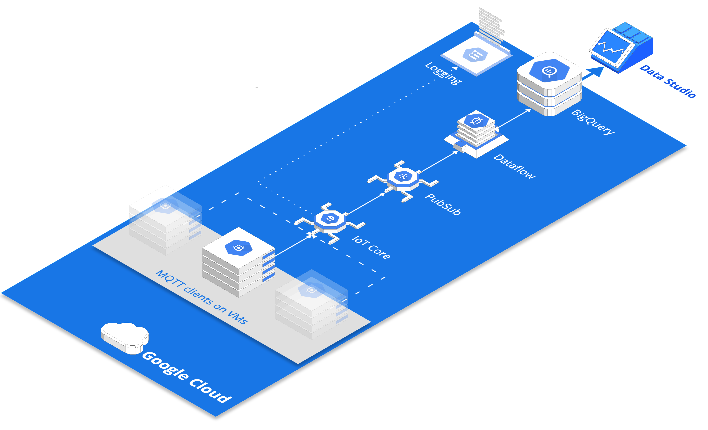

IoT on GCP showcase

# tech stack  
frameworks logos: beam, terraform  
cloud logos: iot core  

# architecture

[Interactive](https://arcentry.com/app/embed.html?id=d16af169-924f-4cc6-8e05-d47ff49298b9&key=762f473ebf01b9181b61ff4dd041132d&live=true&camera=0_13.3518_8.08_-0.7854_0.6155_0.5236_343.8186_450_370.2461&hideViewControls=0)

# spin up

terraform command

# tear down

terraform command

# walkthrough
1. create pubsub topic `telemetry`
2. assign pubsub publisher role to `cloud-iot@system.gserviceaccount.com` 
3. create vm 
4. update and init gcloud sdk on vm (don't use vm sa for auth)
5. install dependencies on vm
6. create iot registry
7. create cryptographical key on vm
8. register devices in iot registry
9. create bigquery table iot.telemetry
10. creat gcs bucket for dataflow staging seva-playground-dataflow-staging
10. create dataflow job
7. run devices
git clone https://gitlab.com/vgoslo/iot-on-gcp
re-generate jwt token if you are getting auth failures
to run in background append `> foo.log &`

NB: for commands, values etc. see terraform script

# result

